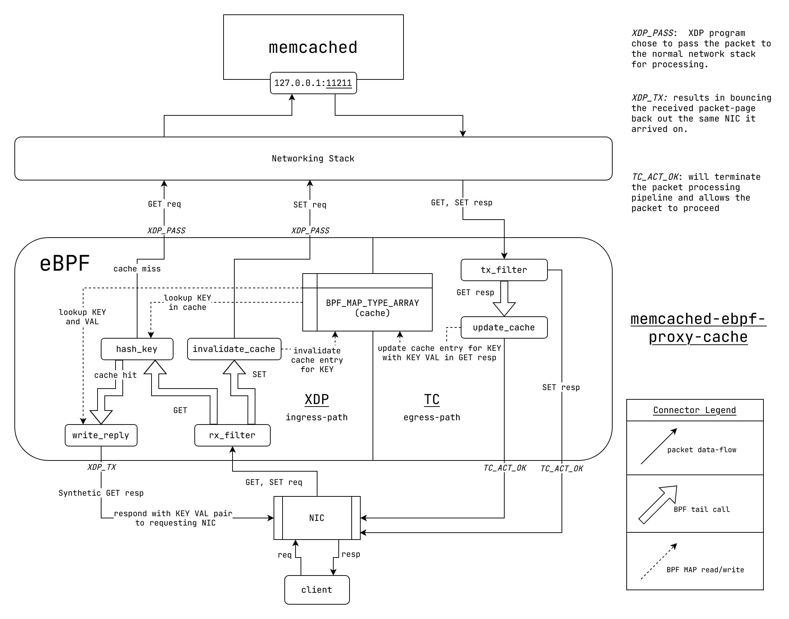

# memcached-ebpf-proxy-cache

Intercept and serve `memcached` requests from eBPF.

> [!WARNING]  
> This project was made for learning purposes and is not meant for production usage.

## Prerequisites

1. Install bpf-linker: `cargo install bpf-linker`

## Build eBPF

```bash
cargo xtask build-ebpf
```

To perform a release build you can use the `--release` flag.
You may also change the target architecture with the `--target` flag.

## Build Userspace

```bash
cargo build
```

## Build eBPF and Userspace

```bash
cargo xtask build
```

## Run

```bash
RUST_LOG=debug cargo xtask run  -- --iface lo
```

## Overview

memcached-ebpf-proxy-cache maintains a smaller cache in the eBPF layer in front of memcached
to service memcached requests right from the eBPF layer. _In theory_, for small GET requests (< 250 bytes),
the networking stack adds a substantial overhead while the request is processed. eBPF allows a way
to intercept and respond to the request even before it enters the networking stack.

> Note: The phrase _In theory_ is important here.

`memcached-ebpf-proxy-cache` works with the `memcached` [binary protocol](https://github.com/memcached/memcached/wiki/BinaryProtocolRevamped).

In NIC's which natively support the eBPF bytecode, these packets can be serviced directly from the NIC.



<p align="center">
<b>Fig:</b> Dataflow through <code>memcached-ebpf-proxy-cache</code>
</p>

### Mode of operation

We maintain a [BPF_MAP_TYPE_ARRAY](https://docs.kernel.org/bpf/map_array.html) for storing the cache
entries in our eBPF program. We use it to implement hashmap as follows:

```
CACHE[ fnv_1_a_hash(key) % CACHE_SIZE ] = (extra, KEY, VAL)
```

where `extra` refers to the `extra` bytes in a memcached `GET` response.

Let's discuss the ingress and egress path seperately.

#### Ingress Path

The ingress path involves the following eBPF programs:

- `rx_filter`: Ingress entrypoint - filters memcached packets and lets other kind of packets pass through.
  For memcached GET packets, it makes as tail call to `hash_key`. For set packets, it makes a tail call to `invalidate_cache`.
- `hash_key`: Hashes the KEY in packet with the the [fnv_1_a_hash](https://en.wikipedia.org/wiki/Fowler%E2%80%93Noll%E2%80%93Vo_hash_function#FNV-1a_hash) algorithm.
  Looks up the entry at `hash % CACHE_SIZE`. If cache-hit, then tail call to `write_reply`, else let
  the packet pass throught with xdp action `XDP_PASS`
- `write_reply`: Modify packet: swap Eth header source dest, ip header source dest, UDP header source dest
  and rewrite body with (extra, KEY, VAL) tuple. Send the packet back to the requesting NIC with `XDP_TX`.
  This effectively processes the memcached request packet completey within our eBPF program.
- `invalidate_cache`: Reached through tail call from `rx_filter` on SET request. Hash key, lookup cache entry at
  index `hash % CACHE_SIZE` and mark it as invalid. Invalid cache entries are updated on the egress path in the
  `update_cache` eBPF program.

#### Egress Path

The egress path involves the following eBPF programs:

- `tx_filter`: Egress entrypoint - filters memcached GET response packets and lets other kinds packets pass
  through with `TC_ACT_OK`. Make a tail call to `update_cache` for GET response packets.
- `update_cache`: Hashes KEY in reponse and looks up entry at `hash % CACHE_SIZE`. If entry is invalid, update
  cache entry with (extra, KEY, VAL) tuple. Once done updating, let the packet pass through with `TC_ACT_OK`.

## Testing

Start tracing UDP packet traffic on port 11211 with the following command:

```sh
sudo tcpdump -Xi lo -vvv -n udp port 11211
```

First, test the control behaviour by running the test:

```sh
cargo test
```

Which runs the following rust code:

```rust

let get_client = memcache::connect(memcached_get_endpoint).unwrap();

let set_client = memcache::connect(memcached_set_endpoint).unwrap();

const KEY: &str = "key";
const VAL: &str = "val";

// SET once. GET twice

set_client.set(KEY, VAL, 10).unwrap();

assert_eq!(get_client.get::<String>(KEY).unwrap().unwrap(), VAL);
assert_eq!(get_client.get::<String>(KEY).unwrap().unwrap(), VAL);
```

Running the test should yield a similar packet dump to the following packet dump:

```
tcpdump: verbose output suppressed, use -v[v]... for full protocol decode
listening on lo, link-type EN10MB (Ethernet), snapshot length 262144 bytes
21:20:40.642266 IP 127.0.0.1.58390 > 127.0.0.1.11211: UDP, length 32
        0x0000:  4500 003c 82b7 4000 4011 b9f7 7f00 0001  E..<..@.@.......
        0x0010:  7f00 0001 e416 2bcb 0028 fe3b 7152 0000  ......+..(.;qR..
        0x0020:  0001 0000 800b 0000 0000 0000 0000 0000  ................
        0x0030:  0000 0000 0000 0000 0000 0000            ............
21:20:40.642572 IP 127.0.0.1.11211 > 127.0.0.1.58390: UDP, length 38
        0x0000:  4500 0042 42f5 4000 4011 f9b3 7f00 0001  E..BB.@.@.......
        0x0010:  7f00 0001 2bcb e416 002e fe41 7152 0000  ....+......AqR..
        0x0020:  0001 0000 810b 0000 0000 0000 0000 0006  ................
        0x0030:  0000 0000 0000 0000 0000 0000 312e 362e  ............1.6.
        0x0040:  3134                                     14
21:20:40.642829 IP 127.0.0.1.58390 > 127.0.0.1.11211: UDP, length 35
        0x0000:  4500 003f 82b8 4000 4011 b9f3 7f00 0001  E..?..@.@.......
        0x0010:  7f00 0001 e416 2bcb 002b fe3e 7153 0000  ......+..+.>qS..
        0x0020:  0001 0000 8000 0003 0000 0000 0000 0003  ................
        0x0030:  0000 0000 0000 0000 0000 0000 6b65 79    ............key
21:20:40.642951 IP 127.0.0.1.11211 > 127.0.0.1.58390: UDP, length 39
        0x0000:  4500 0043 42f6 4000 4011 f9b1 7f00 0001  E..CB.@.@.......
        0x0010:  7f00 0001 2bcb e416 002f fe42 7153 0000  ....+..../.BqS..
        0x0020:  0001 0000 8100 0000 0400 0000 0000 0007  ................
        0x0030:  0000 0000 0000 0000 0000 0115 0000 0000  ................
        0x0040:  7661 6c                                  val
21:20:40.643061 IP 127.0.0.1.58390 > 127.0.0.1.11211: UDP, length 32
        0x0000:  4500 003c 82b9 4000 4011 b9f5 7f00 0001  E..<..@.@.......
        0x0010:  7f00 0001 e416 2bcb 0028 fe3b 7154 0000  ......+..(.;qT..
        0x0020:  0001 0000 800b 0000 0000 0000 0000 0000  ................
        0x0030:  0000 0000 0000 0000 0000 0000            ............
21:20:40.643153 IP 127.0.0.1.11211 > 127.0.0.1.58390: UDP, length 38
        0x0000:  4500 0042 42f7 4000 4011 f9b1 7f00 0001  E..BB.@.@.......
        0x0010:  7f00 0001 2bcb e416 002e fe41 7154 0000  ....+......AqT..
        0x0020:  0001 0000 810b 0000 0000 0000 0000 0006  ................
        0x0030:  0000 0000 0000 0000 0000 0000 312e 362e  ............1.6.
        0x0040:  3134                                     14
21:20:40.643187 IP 127.0.0.1.58390 > 127.0.0.1.11211: UDP, length 35
        0x0000:  4500 003f 82ba 4000 4011 b9f1 7f00 0001  E..?..@.@.......
        0x0010:  7f00 0001 e416 2bcb 002b fe3e 7155 0000  ......+..+.>qU..
        0x0020:  0001 0000 8000 0003 0000 0000 0000 0003  ................
        0x0030:  0000 0000 0000 0000 0000 0000 6b65 79    ............key
21:20:40.643309 IP 127.0.0.1.11211 > 127.0.0.1.58390: UDP, length 39
        0x0000:  4500 0043 42f8 4000 4011 f9af 7f00 0001  E..CB.@.@.......
        0x0010:  7f00 0001 2bcb e416 002f fe42 7155 0000  ....+..../.BqU..
        0x0020:  0001 0000 8100 0000 0400 0000 0000 0007  ................
        0x0030:  0000 0000 0000 0000 0000 0115 0000 0000  ................
        0x0040:  7661 6c                                  val
```

Notice that there are two GET request packets with "key" payload.

Now start `memcached-ebpf-proxy-cache`:

```sh
RUST_LOG=debug cargo xtask run  -- --iface lo
```

Now run `cargo test` and inspect the traffic again.

Running the test should yield a similar packet dump to the following packet dump:

```
tcpdump: verbose output suppressed, use -v[v]... for full protocol decode
listening on lo, link-type EN10MB (Ethernet), snapshot length 262144 bytes
21:25:21.492337 IP 127.0.0.1.51924 > 127.0.0.1.11211: UDP, length 32
        0x0000:  4500 003c 92c7 4000 4011 a9e7 7f00 0001  E..<..@.@.......
        0x0010:  7f00 0001 cad4 2bcb 0028 fe3b 8dbe 0000  ......+..(.;....
        0x0020:  0001 0000 800b 0000 0000 0000 0000 0000  ................
        0x0030:  0000 0000 0000 0000 0000 0000            ............
21:25:21.492539 IP 127.0.0.1.11211 > 127.0.0.1.51924: UDP, length 38
        0x0000:  4500 0042 a004 4000 4011 9ca4 7f00 0001  E..B..@.@.......
        0x0010:  7f00 0001 2bcb cad4 002e fe41 8dbe 0000  ....+......A....
        0x0020:  0001 0000 810b 0000 0000 0000 0000 0006  ................
        0x0030:  0000 0000 0000 0000 0000 0000 312e 362e  ............1.6.
        0x0040:  3134                                     14
21:25:21.492749 IP 127.0.0.1.51924 > 127.0.0.1.11211: UDP, length 35
        0x0000:  4500 003f 92c8 4000 4011 a9e3 7f00 0001  E..?..@.@.......
        0x0010:  7f00 0001 cad4 2bcb 002b fe3e 8dbf 0000  ......+..+.>....
        0x0020:  0001 0000 800c 0003 0000 0000 0000 0003  ................
        0x0030:  0000 0000 0000 0000 0000 0000 6b65 79    ............key
21:25:21.492874 IP 127.0.0.1.11211 > 127.0.0.1.51924: UDP, length 42
        0x0000:  4500 0046 a005 4000 4011 9c9f 7f00 0001  E..F..@.@.......
        0x0010:  7f00 0001 2bcb cad4 0032 fe45 8dbf 0000  ....+....2.E....
        0x0020:  0001 0000 810c 0003 0400 0000 0000 000a  ................
        0x0030:  0000 0000 0000 0000 0000 0117 0000 0000  ................
        0x0040:  6b65 7976 616c                           keyval
21:25:21.493021 IP 127.0.0.1.51924 > 127.0.0.1.11211: UDP, length 32
        0x0000:  4500 003c 92c9 4000 4011 a9e5 7f00 0001  E..<..@.@.......
        0x0010:  7f00 0001 cad4 2bcb 0028 fe3b 8dc0 0000  ......+..(.;....
        0x0020:  0001 0000 800b 0000 0000 0000 0000 0000  ................
        0x0030:  0000 0000 0000 0000 0000 0000            ............
21:25:21.493178 IP 127.0.0.1.11211 > 127.0.0.1.51924: UDP, length 38
        0x0000:  4500 0042 a006 4000 4011 9ca2 7f00 0001  E..B..@.@.......
        0x0010:  7f00 0001 2bcb cad4 002e fe41 8dc0 0000  ....+......A....
        0x0020:  0001 0000 810b 0000 0000 0000 0000 0006  ................
        0x0030:  0000 0000 0000 0000 0000 0000 312e 362e  ............1.6.
        0x0040:  3134                                     14
21:25:21.493441 IP 127.0.0.1.11211 > 127.0.0.1.51924: UDP, length 42
        0x0000:  4500 0046 92ca 4000 4011 a9da 7f00 0001  E..F..@.@.......
        0x0010:  7f00 0001 2bcb cad4 0032 0000 8dc1 0000  ....+....2......
        0x0020:  0001 0000 810c 0003 0400 0000 0000 000a  ................
        0x0030:  0000 0000 0000 0000 0000 0000 0000 0000  ................
        0x0040:  6b65 7976 616c                           keyval
```

**Notice that there is only one GET request and two GETK responses. This is our proof that the last
request was completely handled by the eBPF layer.**

You might also notice that we are getting both key and value in the reponse. That's because we
modify GET requests to GETK requests. This is important because we need the key in the reponse
packet in order to be able to update the cache.

## Benchmarking

Now a word of honesty: this doesn't actually lead to a speedup as we expected, even though we are
able to reduce the number of packets. Actually, we notice an overhead when we run `memcached-ebpf-proxy-cache`.

This project was originally inspired by the paper: ["BMC: Accelerating Memcached using Safe
In-kernel Caching and Pre-stack Processing"](https://www.usenix.org/conference/nsdi21/presentation/ghigoff)

The original paper used the memcached ASCII protocol. Also it made some enhancements to memcached to
be able to utilize [`SO_REUSEPORT`](https://lwn.net/Articles/542629/) to enhance multi-threaded performance.

In the project, I wanted to explore how far I could go using only eBPF and the stock `memcached` package
that's available in Ubuntu 22.04 or Arch Linux package repository. I also opted for the memcached binary
protocol since that's the one that's mostly used in production. So any lack of performance increase is solely
on this particular implementation. A faithful implementation of the paper should definitely be able to achieve
the published speedup.

The original paper authors also provided their own implementation here: <https://github.com/Orange-OpenSource/bmc-cache/>

Now back to our benchmarks. In order the run the benchmarks checkout to the `feat/memcached-bench` branch.

```sh
git checkout feat/memcached-bench
```

Next compare the performance with and without `memcached-ebpf-proxy-cache`.

First run `memcached-bench` while `memcached-ebpf-proxy-cache` is not running with the following command:

```sh
cargo run -p memcached-bench
```

Next run this command while `memcached-ebpf-proxy-cache` is running.

```sh
RUST_LOG=debug cargo xtask run  -- --iface lo

# in a different terminal
cargo run -p memcached-bench
```

Doing this yields the following results on my machine (HP Pavilion x360 Convertible 14-ba0xx running Endeavour OS):

```text
# without memcached-ebpf-proxy-cache
100.00% |█████████████████████████████████████████████████████████████████▏| 91.00/91.00 [00:00:00] (11.58 it/s)
Time spent in SET loop: 7.856820009s
100.00% |███████████████████████████████████████████████████████████████▏| 10.00K/10.00K [00:00:00] (8.20K it/s)
Time spent in GET loop: 1.219417s

# with memcached-ebpf-proxy-cache
100.00% |█████████████████████████████████████████████████████████████████▏| 91.00/91.00 [00:00:00] (11.56 it/s)
Time spent in SET loop: 7.874415797s
100.00% |███████████████████████████████████████████████████████████████▏| 10.00K/10.00K [00:00:00] (5.37K it/s)
Time spent in GET loop: 1.861354611s
```

There's a slight decrease in performance instead of the increase in performance we were expecting.

There can be a couple of reasons for this:

- The binary protocol may be inherently much more efficient than the ASCII protocol, where the overhead due to
  the networking stack doesn't matter. Rather the `memcpy()` in the eBPF layer might be incurring an overhead.
- Lack of proper [`bpf_spin_lock`](https://docs.kernel.org/bpf/graph_ds_impl.html#id3) support in aya-rs - [aya-rs
  currently lacks support for bpf_spin_lock](https://github.com/aya-rs/aya/issues/857) due to this
  [issue](https://github.com/aya-rs/aya/issues/351) as of 22-09-2024. So I improvised and implemented my
  own spinlock using atomic instrinsics. My implementation may not be as efficient as the real thing.
- We are sending back both the KEY and VAL in GET requests. This can incur a data transfer overhead.
  (Although, we are still on localhost.)

Regardless this was a fun learning exercise. I learned a lot about:

- XDP and TC packet filtering and processing
- Packet unpacking and restructuring at different protocol levels
- Tail calls
- Different map types: BPF Map type Array, Program Array, Per CPU array etc.
- Atomic instrinsics
- Satisfying the eBPF verifier with proper loop range and memory acccess bounds

I have more or less achieved what I wanted to - which was to understand how to write eBPF programs. So I'll stop
here for now. Regardless, all contributions to improve performance are very much welcome.
